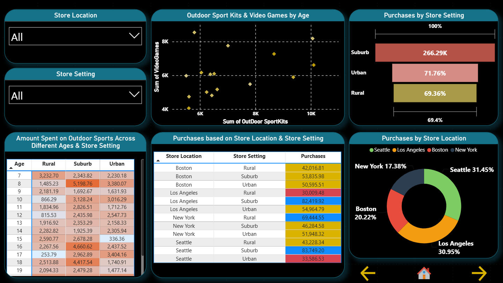
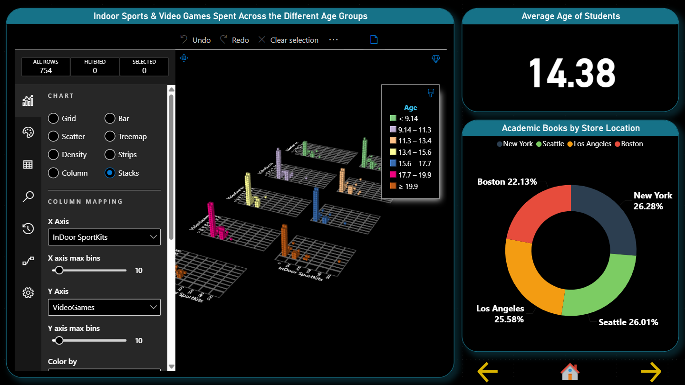
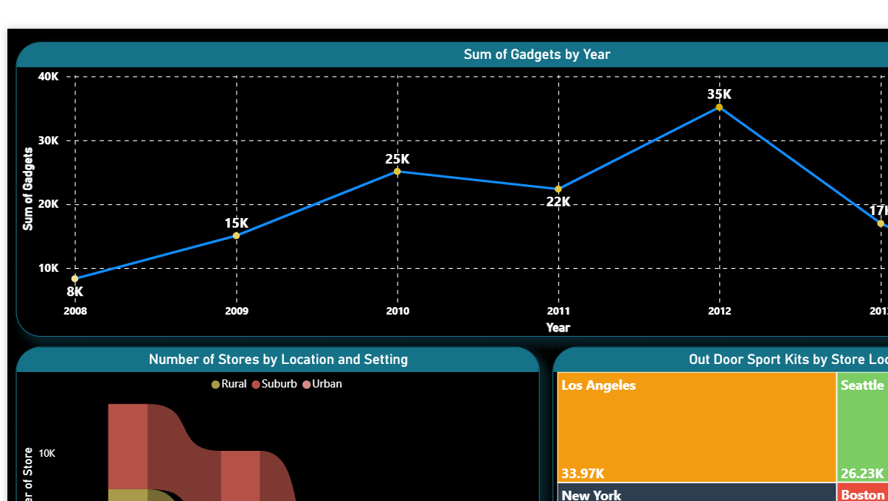
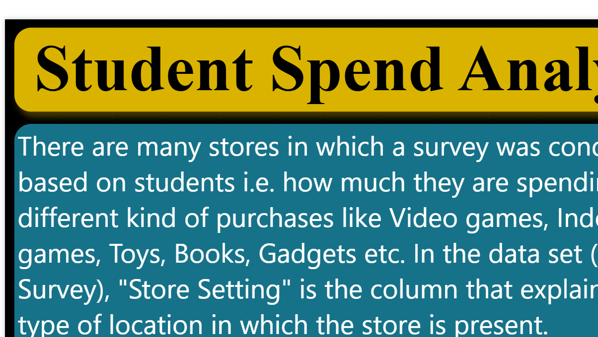

# 📊 Student Spend Analysis | Power BI

## 📌 Project Overview

This Power BI project analyzes student purchasing behavior across different product categories, age groups, store locations, and store settings.

The objective is to transform student survey data into an interactive and visually engaging dashboard that helps identify spending patterns, purchasing preferences, and differences in consumer behavior across student demographics.

The report contains multiple interactive pages with filters, comparisons, trend analysis, and geographic insights.

---

## 🎯 Business Questions

This analysis explores several key questions:

- How does student spending vary across different age groups?
- Which product categories receive the highest student spending?
- How do purchases differ across store locations?
- How does store setting influence purchasing behavior?
- How does spending on outdoor sports and video games vary by age?
- How does academic book spending differ across locations?
- How does gadget spending change over time?
- How are stores distributed across different locations and settings?

---

## 📊 Dashboard Preview

### 🛍️ Purchase & Store Analysis

This dashboard provides an interactive view of student purchasing behavior by store location and store setting. It combines filters, comparative tables, and visualizations to explore spending across different categories.



---

### 🎓 Student Age & Category Analysis

This section examines how spending behavior varies across student age groups and product categories, including outdoor sports, indoor sports, video games, and other purchases.



---

### 📈 Spending Trends & Location Analysis

This dashboard explores purchasing trends and geographic differences, including gadget spending over time and spending patterns across different store locations.



---

### 📍 Student Spending Overview

The overview provides an additional visual perspective on student spending patterns and purchasing behavior across the dataset.



---

## 🔍 Analysis Highlights

The dashboard enables users to explore:

- Student purchasing behavior across different age groups
- Spending differences across product categories
- Store-location purchasing patterns
- Store-setting comparisons
- Academic book spending by location
- Outdoor and indoor sports spending
- Video game purchasing behavior
- Gadget spending trends
- Distribution of stores across locations and settings

Interactive slicers allow users to dynamically filter the report and examine specific segments of the student population.

---

## 💡 Business Value

Understanding student purchasing behavior can help retailers make more informed decisions related to:

- Product assortment
- Inventory planning
- Store strategy
- Customer segmentation
- Targeted marketing
- Product positioning
- Location-based decision-making

The dashboard converts survey data into actionable visual insights that make purchasing patterns easier to identify and communicate.

---

## 🛠️ Tools & Technologies

- Microsoft Power BI
- Power Query
- DAX
- Data Modeling
- Data Cleaning & Transformation
- Interactive Data Visualization
- Slicers & Filters
- Custom Visualizations
- SandDance Visualization

---

## 💼 Skills Demonstrated

- Power BI dashboard development
- Data transformation and preparation
- Data modeling
- DAX-based analysis
- KPI and metric development
- Interactive report design
- Trend analysis
- Demographic analysis
- Location-based analysis
- Data storytelling
- Business insight generation
- Report navigation and user interaction

---

## 📂 Project Structure

```text
Student-Spend-Analysis/
│
├── images/
│   ├── student-spend-age-analysis.png
│   ├── student-spend-dashboard.png
│   ├── student-spend-overview.png
│   └── student-spend-trends.png
│
├── README.md
└── Student-Spend-Analysis.pbix
